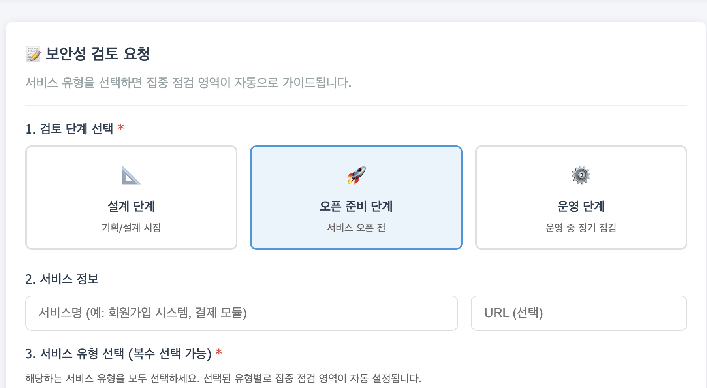
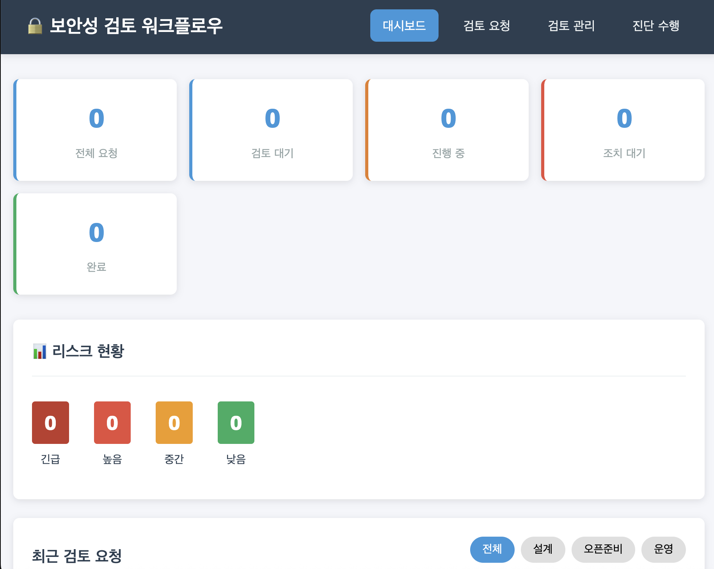

# 보안성 검토 워크플로우 시스템 구축기

최근 보안성 검토 업무의 효율성을 높이기 위해 **정보 흐름 기반의 보안성 검토 워크플로우 시스템**을 개발했습니다. 이 프로젝트는 개발 초기 단계부터 보안 리스크를 식별하고, 서비스 유형에 맞는 맞춤형 점검 가이드를 제공하는 것을 목표로 합니다.

## 🛠 왜 만들었나?

보안팀의 리소스는 한정적이지만, 검토해야 할 서비스는 끊임없이 늘어납니다. 특히 반복적인 검토 업무나 정형화된 패턴이 있는 경우, 이를 시스템화하면 다음과 같은 이점이 있습니다.

*   **일관성 유지:** 검토자 개인의 역량에 의존하지 않고 표준화된 기준 적용
*   **효율성 증대:** 리스크 점수 자동 산정 및 불필요한 커뮤니케이션 감소
*   **데이터 자산화:** 검토 이력과 결과를 DB에 저장하여 추후 통계 및 감사 증적 활용

## 🚀 주요 기능

이 시스템은 크게 4가지 핵심 모듈로 구성되어 있습니다.

### 1. 검토 요청 (Request)
     
     
사용자(개발자/담당자)가 서비스의 기본 정보를 입력하는 단계입니다.
*   **서비스 유형 선택:** 결제, 인증, 개인정보, 외부연동 등 다중 선택 가능
*   **리스크 자동 산정:** 선택한 서비스 유형과 비즈니스 영향도(금전, 평판 등)를 가중치로 계산하여 Risk Score와 Level(Critical ~ Low)을 도출

### 2. 검토 관리 (Review)
     
보안 담당자가 접수된 요청을 확인하고 관리하는 단계입니다.
*   서비스 유형에 따라 중점적으로 봐야 할 **'집중 점검 가이드'** 제공
*   진단 진행 여부 판단 및 상태 관리 (진행 중, 조치 대기, 완료 등)

### 3. 진단 수행 (Diagnosis)
     
실제 보안성 검토를 수행하는 단계로, 정보 흐름(Flow)에 따른 체크포인트가 자동 생성됩니다.
*   **Flow:** Client → Network → Gateway → Application → Data
*   영역별 체크포인트에 대해 Pass/Fail/N/A 판정 및 결과 기록

### 4. 대시보드 (Dashboard)
     
전체 진행 상황을 한눈에 볼 수 있습니다.
*   리스크 등급별 현황
*   진행 상태별 통계
*   최근 요청 목록

## � 보안 아키텍처 관점 (Security Architecture Perspective)

이 시스템은 단순한 도구 도입을 넘어, 전사적 보안 아키텍처 관점에서 **'보안성 검토의 집중화(Centralized Security Review)'**를 지향합니다.

*   **보안성 검토의 집중화:** 파편화된 검토 요청 채널(메일, 메신저 등)을 단일 시스템으로 통합하여, 전사적인 보안 리스크 현황을 가시화했습니다.
*   **일관된 정책 적용:** 서비스 유형(Service Types)별로 정의된 보안 정책이 시스템에 내재화되어 있어, 검토자의 개인차 없이 일관된 보안 기준을 적용할 수 있습니다.
*   **데이터 기반의 보안 강화:** 축적된 검토 결과 데이터는 추후 취약점이 빈번한 영역을 파악하고, 보안 가이드나 교육이 필요한 부분을 식별하는 중요한 자산이 됩니다.

## �💻 기술 스택 (Tech Stack)

가볍고 빠른 실행을 위해 Python 기반의 경량화된 스택을 사용했습니다.

*   **Backend:** Python **Starlette** (비동기 처리, 경량 프레임워크)
*   **Database:** **SQLite** (별도 설치 없이 즉시 사용 가능한 로컬 DB)
*   **Frontend:** Vanilla JS, CSS (복잡한 번들링 없이 수정 용이성 확보)
*   **Infrastructure:** Python 설치 환경 어디서나 구동 가능

## 📂 프로젝트 구조

```bash
securityprocess/
├── app.py              # 메인 애플리케이션 (Starlette)
├── security_review.db  # 데이터베이스
├── frontend/           # UI 리소스
│   ├── index.html
│   ├── request.html
│   └── ...
└── requirements.txt    # 의존성 목록
```

## 🏁 마치며

이 시스템은 단순히 체크리스트를 디지털화한 것을 넘어, **'서비스 유형에 따른 유연한 대응'**이 가능하도록 설계되었습니다. 향후에는 Jira/Slack 연동 기능을 추가하여 업무 협업 도구와의 통합을 강화할 계획입니다.

