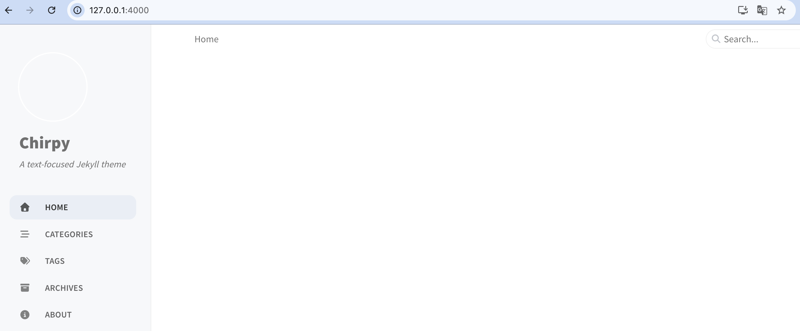
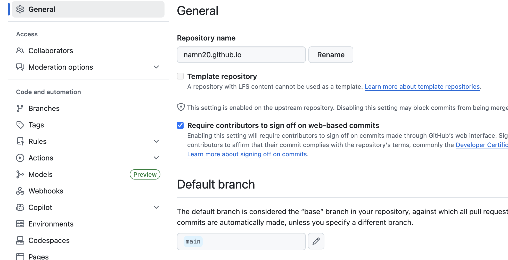
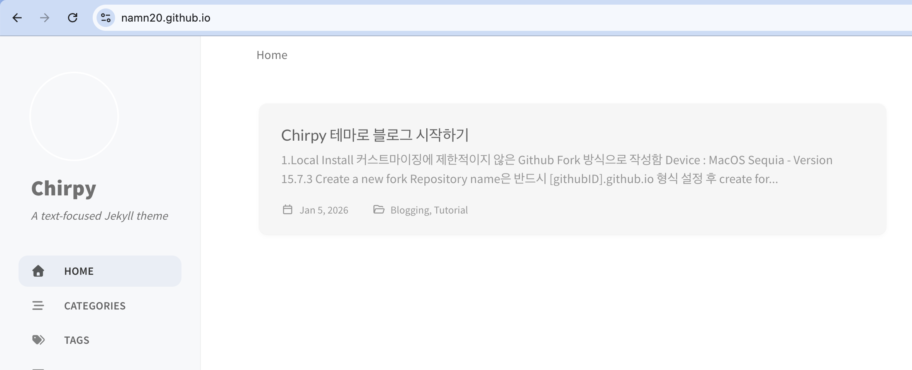

## 1.Local Install

커스트마이징에 제한적이지 않은 [Github Fork](https://github.com/cotes2020/jekyll-theme-chirpy) 방식으로 작성함
- Device : MacOS Sequia - Version 15.7.3

1. Create a new fork 
- Repository name은 `[example].github.io` 형식
- 설정 후 create fork 

2. Source Clone
```bash
$ git clone https://github.com/namn20/namn20.github.io.git
```

3. 초기화 
- fork로 소스코드를 가져왔기 때문에 테마 자체 개발시 필요한 파일 삭제 
```bash
$ tools/init.sh
```

4. ruby Install
- ruby를 설치했지만 version 문제로 다운그레이드 수행 후 환경 변수 설정
    > **경고:** 현재 루비 버전이 테마와 호환되지 않습니다. 3.1 버전 이상이 필요합니다. 4.0.0은 아직 호환이 안되는것 같음
    {: .prompt-warning }

5. npm Install
```bash
$ npm install && npm run build
```

6. jekyll 실행을 위한 모듈 설치
- 나의 로컬로 이동하여 bundle install
```bash
$ cd namn20.github.io
$ bundle install
```

7. 설치가 완료 후 로컬에서 jekyll 실행
- 실시간 반영을 위해 서버 실행 실행할때 `--furure` 옵션 추가
```bash
$ bundle exec jekyll serve --future
```

8. 웹 브라우저 127.0.0.1:4000 주소로 블로그 정상적으로 표시되는지 확인
- 블로그 내 여러 메뉴 및 기능들도 정상 동작하는지 확인
    


## 2. Github Deploy

실제 소스코드를 Github에 배포 

1. Branch를 Master에서 Main으로 변경 
- Setting -> General -> Defaut branch : `main`
     

2. 배포 변경 
- Settings -> Code and authomation -> Pages 
  - Build and deployment : `Github Actions`
     > **경고:** GitHub Actions로 소스를 변경하지 않거나, Configure를 완료하지 않고 배포할 경우 에러가 발생될수 있음
    {: .prompt-warning }
- `jekyll.yml 이 배포 설정 파일`

3. git 배포를 위해 _post 경로에 테스트용 생성 후 git push
     
```bash
$ git add -A
$ git commit -m "chore: first commit"
$ git push origin main -f
```
- 강제로 한 이유는 tools.init 명령을 통해 버전이 변경되어 (원격이 더 최근 버전으로 인지함)

4. 블로그 확인
-  [제 블로그](https://namn20.github.io/) 접속 성공적으로 반영됨을 확인
   -     