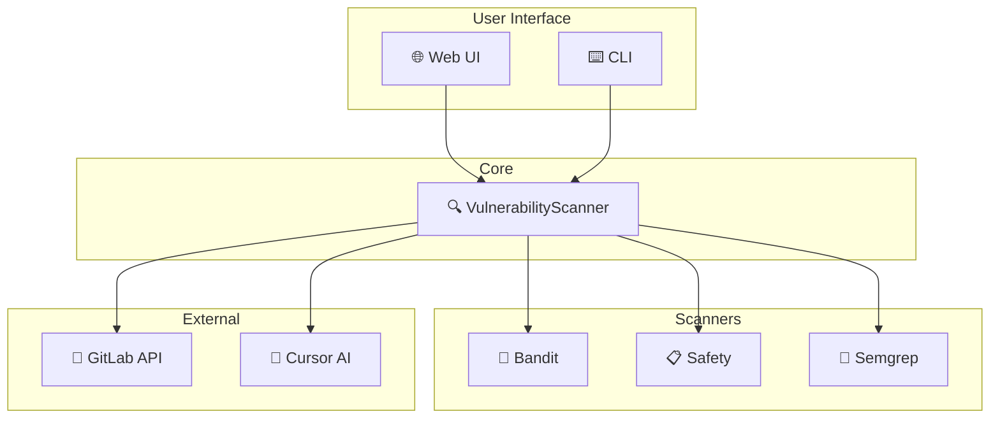

# 🔍 SecOps: GitLab 소스코드 정적 분석 시스템 개발기

## 📌 프로젝트 소개

기업 환경에서 소스코드 보안 취약점을 효율적으로 관리하기 위해 **SecOps**를 개발했습니다. GitLab 저장소와 연동하여 자동으로 소스코드를 분석하고, AI(Cursor)를 활용한 정오탐 분석까지 지원하는 통합 보안 감사 도구입니다.

## 🎯 개발 배경

### 문제점
- 수동 코드 리뷰의 한계와 시간 소요
- 다양한 보안 도구 결과의 분산 관리
- 오탐(False Positive) 처리의 어려움
- 폐쇄망 환경에서의 보안 도구 운영 어려움

### 해결 목표
- ✅ GitLab 저장소 자동 연동
- ✅ 다중 보안 스캐너 통합
- ✅ 웹 기반 UI로 쉬운 사용성
- ✅ AI 연동 정오탐 분석 지원
- ✅ 오프라인/폐쇄망 환경 지원

## 🛠️ 기술 스택

| 분류 | 기술 |
|------|------|
| **Backend** | Python 3.11+, http.server |
| **Security Scanners** | Semgrep, Bandit, Safety |
| **GitLab 연동** | GitPython, requests |
| **UI** | Vanilla HTML/CSS/JavaScript |
| **AI 연동** | Cursor AI (Claude) |

## 📐 시스템 아키텍처



## 💡 주요 기능

### 1. 다중 스캐너 통합

```python
class VulnerabilityScanner:
    def _initialize_scanners(self):
        scanners = {}
        if self.config.get('bandit', {}).get('enabled', True):
            scanners['bandit'] = BanditScanner()
        if self.config.get('safety', {}).get('enabled', True):
            scanners['safety'] = SafetyScanner()
        if self.config.get('semgrep', {}).get('enabled', True):
            scanners['semgrep'] = SemgrepScanner()
        return scanners
```

### 2. 언어 자동 감지 및 스캐너 추천

저장소의 파일 확장자와 설정 파일을 분석하여 프로그래밍 언어를 자동 감지하고, 적합한 스캐너만 실행합니다.

```python
def detect_languages(self, repo_path: str) -> List[str]:
    detected = []
    for root, dirs, files in os.walk(repo_path):
        for file in files:
            if file.endswith('.py'):
                detected.append('python')
            elif file.endswith(('.js', '.ts', '.vue')):
                detected.append('javascript')
    return list(set(detected))
```

### 3. 코드 컨텍스트 표시

취약점 발견 시 해당 라인만이 아닌 **주변 5줄의 컨텍스트**를 함께 표시하여 정오탐 판별을 용이하게 합니다.

```javascript
     115 | <template>
     116 |   <div class="container">
>>>  117 |     <div v-html="userInput"></div>
     118 |   </div>
     119 | </template>
```

### 4. AI 정오탐 분석 지원

스캔 결과를 Cursor AI가 분석할 수 있는 마크다운 형식으로 변환합니다.

```markdown
## 취약점 #1: avoid-v-html

| 항목 | 값 |
|------|-----|
| **파일** | src/components/index.vue |
| **라인** | 117 |
| **심각도** | WARNING |
| **CWE** | CWE-79 (XSS) |

### 🤖 AI 분석 결과
**판정:** ⚠️ 추가 검토 필요
**근거:** NFT 메타데이터가 외부 소스에서 오는 경우 XSS 가능
**권장 조치:** DOMPurify 적용
```

## 🔧 핵심 구현 포인트

### 1. 오프라인 환경 지원

폐쇄망 환경을 위해 Semgrep의 로컬 규칙 사용과 메트릭 전송 비활성화를 구현했습니다.

```python
cmd = [
    'semgrep', 'scan',
    '--config', 'rules/semgrep-rules/javascript',
    '--json',
    '--metrics=off',  # 네트워크 요청 차단
]
```

### 2. SSL 인증서 문제 해결

자체 서명 인증서를 사용하는 GitLab 서버를 위해 SSL 검증을 선택적으로 비활성화할 수 있습니다.

```python
ssl_verify = os.getenv('GITLAB_SSL_VERIFY', 'false').lower() == 'true'
response = requests.get(url, verify=ssl_verify)
```

### 3. Windows 환경 호환성

Windows의 cp949 인코딩 문제를 해결하기 위해 UTF-8 강제 설정을 적용했습니다.

```python
env = os.environ.copy()
env['PYTHONUTF8'] = '1'
env['PYTHONIOENCODING'] = 'utf-8'
```

## 📊 실제 사용 사례

### 스캔 결과 예시

| 프로젝트 | 언어 | 취약점 | 주요 발견 |
|---------|------|--------|-----------|
| www-scope | Vue.js | 16건 | v-html XSS, ReDoS |
| api-server | Python | 8건 | SQL Injection, Hardcoded secrets |
| mobile-app | React Native | 12건 | Eval injection |

### 정오탐 분석 결과

| 판정 | 건수 | 비율 |
|------|------|------|
| ✅ 정탐 (수정 필요) | 5건 | 31% |
| ❌ 오탐 (무시 가능) | 7건 | 44% |
| ⚠️ 추가 검토 | 4건 | 25% |

## 🚀 향후 계획

1. **추가 스캐너 지원**
   - Trivy (컨테이너 취약점)
   - npm audit (Node.js 의존성)
   - OWASP Dependency-Check

2. **자동화 파이프라인 연동**
   - GitLab CI/CD 통합
   - Webhook 기반 자동 스캔

3. **대시보드 고도화**
   - 취약점 트렌드 시각화
   - 프로젝트별 보안 점수

4. **AI 기능 강화**
   - 자동 수정 코드 제안
   - 유사 취약점 패턴 학습

## 📝 마치며

SecOps는 DevSecOps 문화를 쉽게 도입할 수 있도록 설계되었습니다. 특히 **Cursor AI와의 연동**을 통해 보안 전문가가 아니더라도 취약점의 실제 위험도를 판단할 수 있습니다.

오픈소스로 공개 예정이며, 피드백과 기여를 환영합니다! 🙌

---

## 🔗 관련 링크

- [GitHub Repository](https://github.com/yourusername/secops)
- [Semgrep Rules](https://github.com/semgrep/semgrep-rules)
- [Bandit Documentation](https://bandit.readthedocs.io/)
- [Cursor AI](https://cursor.sh/)

---

*본 포스트는 실제 기업 환경에서 SecOps를 개발하고 운영한 경험을 바탕으로 작성되었습니다.*

