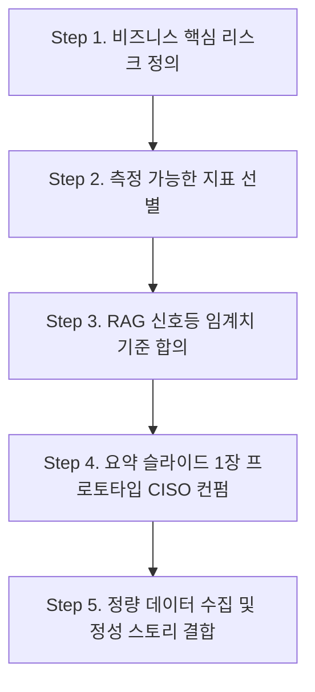

# CISO 및 경영진 보고를 위한 보안 KPI/KRI 설계와 거버넌스 장표 구성안

정보보안 정책 담당자로 10년 넘게 일하면서 가장 많이 받는 질문이자 늘 골머리를 앓는 주제가 있습니다. 바로 **"보안 성과를 어떻게 CISO와 경영진(CEO, 이사회)에게 보고해야 하는가?"**입니다.

경영진 보고 자리에서 "이번 분기에 웹 방화벽이 SQL Injection 공격을 15만 건 차단했고, 백신이 악성코드 320건을 치료했습니다"와 같은 기술적 수치 위주로 장표를 채우면, 경영진의 반응은 대개 싸늘합니다. 그들이 보고 싶은 것은 **"그래서 우리 회사의 비즈니스가 보안 위협으로부터 안전한가? 우리가 투자한 비용 대비 보안 체계가 제대로 작동하고 있는가?"**이기 때문입니다.

이 글에서는 10년차 보안 정책 담당자의 실무 경험을 바탕으로, **경영진의 언어**에 맞춘 **보안 KPI(성과 지표) 및 KRI(위험 지표) 설계법**부터, **실무 데이터 및 리스크 수집 경로**, 그리고 **CISO/경영진 보고용 거버넌스 장표 5단 구성안**까지 총정리하여 공유합니다.

---

## 1. 보안 KPI vs KRI: 무엇이 다르고 왜 구분해야 할까?

경영진 보고 시 가장 흔히 하는 실수가 성과 지표(KPI)와 위험 지표(KRI)를 혼용하는 것입니다. 이 둘은 바라보는 방향이 정반대입니다.

| 구분 | KPI (Key Performance Indicator) | KRI (Key Risk Indicator) |
| :--- | :--- | :--- |
| **관점** | **과거 & 현재 성과 (Backward-looking)** | **미래 & 예측 위험 (Forward-looking)** |
| **목표** | 보안 활동의 효과성과 목표 달성도 측정 | 비즈니스에 심각한 타격을 줄 수 있는 잠재 위험 조기 경보 |
| **질문** | "보안팀이 해야 할 일을 계획대로 잘 수행했는가?" | "우리가 지금 감당하기 힘든 위협 노출도가 증가하고 있는가?" |
| **성격** | 프로세스 준수율, 예방 활동 위주 | 취약점 미조치 기간, 위협 지표 임계치 초과 여부 |

> [!NOTE]
> **KPI가 좋다고 해서 조직이 안전한 것은 아닙니다.** 예를 들어, "보안 교육 이수율 100%(KPI)"를 달성했더라도, "퇴사 예정자의 대용량 클라우드 데이터 반출 시도 건수(KRI)"가 급증하고 있다면 조직의 위험 수준은 매우 높은 상태입니다. 따라서 보고 시에는 반드시 두 지표의 균형이 필요합니다.

---

## 2. 경영진 보고용 핵심 보안 지표(KPI/KRI) 추천 풀(Pool)

실무에서 바로 활용할 수 있는 대표적인 KPI와 KRI 예시입니다. 회사의 산업군과 자산 특성에 맞춰 선별하여 사용하시는 것을 추천합니다.

### 🛡️ 1) 기술 및 취약점 관리 영역
*   **KPI (성과)**
    *   **보안 취약점 조치율(%)**: 탐지된 취약점 중 SLA(Service Level Agreement) 내 조치 완료된 비율.
    *   **자산 식별 및 커버리지(%)**: 중앙 자산 관리 시스템(CMDB)에 등록되어 보안 에이전트가 정상 설치된 자산 비율.
*   **KRI (위험)**
    *   **미조치 고위험 취약점 수(건)**: CVSS 8.0 이상 취약점 중 조치 기한을 초과하여 방치된 취약점 수 (기간별 트렌드 추적).
    *   **패치 미적용 인프라 비율(%)**: 릴리스 후 30일 이상 지난 OS/미들웨어 패치가 반영되지 않은 서버 비율.

### 👥 2) 인적 보안 및 내부 위협 영역
*   **KPI (성과)**
    *   **보안 교육/모의 훈련 참여율(%)**: 연간 법정 의무 교육 및 악성 메일 모의 훈련 참여도.
    *   **보안 위반 사항 시정 처리율(%)**: 내부 감사 및 상시 점검 시 지적사항 조치율.
*   **KRI (위험)**
    *   **악성 메일 모의 훈련 감염률(%)**: 훈련용 피싱 메일의 링크 클릭 또는 첨부파일 실행 비율 (이 비율이 상승하면 임직원 보안 인식 경보 가동).
    *   **이상 징후 탐지 및 임계치 초과 건수(건)**: DLP/정보기기 통제 솔루션에서 탐지된 심야 시간대 대용량 데이터 반출 시도 또는 미승인 USB 사용 시도 건수.

### ⚡ 3) 침해사고 대응 및 운영 영역
*   **KPI (성과)**
    *   **평균 탐지 시간 (MTTD - Mean Time To Detect)**: 실제 공격/이벤트 발생 시점부터 보안 관제에서 최초 인지할 때까지 소요된 시간.
    *   **평균 대응/복구 시간 (MTTR - Mean Time To Respond)**: 침해 징후 인지 시점부터 격리 및 분석, 서비스 복구 완료까지 소요된 시간.
*   **KRI (위험)**
    *   **보안 관제 임계치 초과 경보 수(건)**: 정상 범위를 벗어난 이상 트래픽 발생이나 무차별 대입 공격(Brute Force) 시도 차단 실패 건수.
    *   **단일 장애점(SPOF) 존재 시스템 수(건)**: 이중화가 구성되지 않아 보안 사고 시 전사 서비스 중단으로 이어질 수 있는 자산 수.

---

## 3. CISO 및 경영진 보고용 거버넌스 장표 5단 구성안

CISO 및 경영진 보고(월간/분기/반기) 시 활용하기 가장 좋은 논리적 흐름을 가진 5장짜리 장표 슬라이드 구성안입니다.

### 📊 Slide 1: Executive Summary (보안 종합 현황판)
*   **목적**: 바쁜 경영진이 슬라이드 한 장으로 회사의 보안 건강 상태를 즉시 파악하도록 돕습니다.
*   **시각화 구성**: **RAG(Red-Amber-Green) 신호등 방식** 활용.
*   **상세 내용**:
    *   **거버넌스 & 컴플라이언스**: 녹색 (인증 유지 정상)
    *   **기술 보안 (취약점)**: 황색 (신규 인프라 확장으로 인한 미조치 취약점 일시적 증가)
    *   **인적 보안**: 적색 (최근 악성 이메일 모의 훈련 감염률 목표치 초과)
    *   **핵심 요약(Bullet Points 3줄 이내)**: 금분기 핵심 성과 1가지, 현재 가장 주의해야 할 위험 요인 1가지, 이에 대한 보안팀의 대응 방향성 제시.

### 🏛️ Slide 2: 보안 거버넌스 및 컴플라이언스 현황
*   **목적**: 회사가 법적, 규제적 관점에서 안전망을 갖추고 있는지 증명합니다.
*   **시각화 구성**: 연간 컴플라이언스 일정 로드맵 타임라인.
*   **상세 내용**:
    *   **인증 및 심사 결과**: ISMS-P, ISO/IEC 27001 등 유지 현황 및 심사 결과 지적 사항 조치 상태.
    *   **예산 및 집행**: 올해 보안 예산 대비 현재 집행률(%)과 주요 투자 영역(솔루션 도입, 외주 용역 등) 상태 공유.
    *   **보안 위원회 개최 결과**: 사내 정보보호위원회 개최 여부 및 주요 의결 안건 요약.

### 📈 Slide 3: 핵심 보안 KPI & KRI 트렌드 분석
*   **목적**: 보안 투자가 제대로 기능하고 있는지 시계열 트렌드로 입증하고 잠재적 리스크 영역을 공유합니다.
*   **시각화 구성**: 좌측(KPI 추이 - 꺾은선 그래프), 우측(KRI 경보 현황 - 게이지(Gauge) 차트 또는 스파이더 차트).
*   **상세 내용**:
    *   최근 3~4분기 동안의 주요 지표 추이 제시.
    *   예: "지속적인 보안 패치 관리 자동화(KPI 도입)로 인해, 시스템 평균 취약점 조치 기간(KRI)이 15일에서 4일로 단축됨"과 같은 인과 관계 입증.

### 🎯 Slide 4: 주요 위협 동향 및 대응 태세 (침해/훈련)
*   **목적**: 외부 위협 동향과 이에 대한 우리 조직의 실제 방어 체계 작동 여부를 증명합니다.
*   **시각화 구성**: 모의 침해 훈련 결과 요약 테이블 및 탐지/대응 프로세스 흐름도.
*   **상세 내용**:
    *   **대외 보안 위협 트렌드**: 동종 업계의 랜섬웨어 침해 사례 또는 공급망 공격 이슈 요약.
    *   **자사 대응 태세**: 이에 대응하기 위해 수행한 내부 모의 침해 훈련(Red Teaming) 결과 및 임직원 피싱 메일 대응력 개선 상태.
    *   **MTTD / MTTR 지표**: 실제 보안 이벤트 발생 시 모니터링 데스크의 차단 성능 입증.

### 💡 Slide 5: 결론 및 경영진 의사결정 요청 사항 (Ask to Board)
*   **목적**: 보고의 종착역입니다. 보안팀의 애로사항을 전달하고 실질적인 자원 지원이나 정책 승인을 받아냅니다.
*   **시각화 구성**: 명확한 1:1 대응 구조 테이블 (현상 및 위험 ➔ 해결을 위한 요청안).
*   **상세 내용**:
    *   **의사결정 요구**: 새로운 규제 대응을 위한 인력 충원 승인 건, 신규 보안 위협 차단을 위한 솔루션 예산 확보 승인 건 등.
    *   **정책 개정안 승인**: 재택근무 보안 가이드라인 개정, 클라우드 자산 사용 승인 결재선 변경 등 경영진의 결정이 필수적인 사항 명시.

---

## 4. 실무 적용을 위한 5단계 실행 로드맵 (Action Plan)

이 가이드의 내용을 회사에 정착시키고 장표 작성을 착수할 때 추천하는 현실적인 실행 순서입니다.

*   **Step 1. 비즈니스 핵심 리스크 정의**: 우리 비즈니스가 가장 무서워하는 사고(개인정보 대규모 유출, 설계 도면 유출, 서비스 중단 등) Top 3를 정의합니다.
*   **Step 2. 측정 가능한 지표 선별**: 당장 신뢰성 있게 추출할 수 있는 핵심 지표 3~5개를 선별합니다.
*   **Step 3. RAG 신호등 임계치 기준 합의**: Red(경보), Amber(주의), Green(정상)을 나눌 구체적인 수치 기준을 유관부서와 논의하여 초안을 잡습니다.
*   **Step 4. 요약 슬라이드 1장 프로토타입 컨펌**: 5장을 다 그리기 전에, Slide 1의 대시보드 뼈대만 그려서 CISO(또는 보안팀장)에게 보고 방향성(비즈니스 리스크 관점 개편)에 대한 1차 피드백을 받습니다.
*   **Step 5. 정량 데이터 수집 및 정성 스토리 결합**: 최종 수치를 대입하고, 단순 숫자 뒤에 숨겨진 개선 포인트와 지원 요청사항을 스토리라인으로 연결해 장표를 완성합니다.

---

## 5. \"저 데이터를 어디서 찾지?\" - 실무자를 위한 핵심 소스 및 시스템 매핑

실무를 막 시작했을 때 가장 당황스러운 것은 "리스크"와 "지표 데이터"를 어디서 가져오는지 모른다는 점입니다. 사내에서 즉시 확보 가능한 소스 경로입니다.

### 🏢 ① 비즈니스 핵심 리스크를 찾는 사내 문서
*   **금융감독원 전자공시시스템(DART)의 '사업보고서'**: 상장사라면 DART에서 자사명을 검색한 뒤 사업보고서의 **`\"투자위험요소\"`** 섹션을 확인합니다. 회사가 공식 공시한 IT/개인정보/비즈니스 연속성 관련 위협 요인이 고스란히 담겨 있습니다.
*   **기존 보안 인증용 '위험평가(Risk Assessment) 보고서'**: 사내 ISMS-P나 ISO27001 심사 준비 증적 폴더를 뒤져 **`\"위험성 평가 결과 보고서\"`** 엑셀 파일을 찾습니다. 우리 인프라 자산별 위험 등급(High/Medium/Low) 분석표가 이미 나와 있습니다.
*   **전사 및 IT 본부 연간 사업계획서**: 기획실이나 IT기획팀에서 공유한 사업 계획을 보며, 올해 신규 서비스 출시나 클라우드 전환 등의 목표와 보안 방향을 정렬시킵니다.

### 💻 ② 지표 데이터를 추출하는 시스템 및 보안 솔루션 매핑
실제 원천 데이터(Raw Data)를 확인하여 분기별 통계치를 낼 수 있는 사내 보안 인프라 목록입니다.

| 보안 도메인 | 지표명 예시 | 확인해야 할 사내 시스템 / 솔루션 |
| :--- | :--- | :--- |
| **취약점 관리** | 미조치 고위험 취약점 수, 취약점 조치 준수율 | *   **인프라 취약점 진단 도구**: Nessus, Qualys, 가비아 등 *   **소스코드/오픈소스 보안 도구**: SonarQube, Snyk, Trivy 등 *   **CSPM (클라우드 설정 관리)**: Prowler, Prisma Cloud 등 |
| **단말/자산 보안** | 에이전트 설치율, 패치 미적용률 | *   **PMS (패치관리시스템)**: Tgate, NetHelper, WSUS 등 *   **DLP / 매체제어 솔루션**: Gradius, DLP 콘솔 등 *   **EDR / 백신 중앙 관리 서버**: AhnLab EPP, CrowdStrike 등 |
| **인적 위험 통제** | 피싱 훈련 감염률, 미승인 SaaS 차단율 | *   **피싱 모의훈련 솔루션**: 모의 훈련 수행 후 제공되는 결과 리포트 *   **망분리/프록시 서버 (Secure Web Gateway)**: 웹 방화벽 또는 Proxy 콘솔의 \"미승인 외부 웹서비스(SaaS) 차단 로그\" |
| **업무 효율성** | 보안성 검토 평균 소요 시간 | *   **사내 티켓/협업 시스템**: **Jira** 또는 **ITSM** *   *측정법*: \"보안성 검토\" 또는 \"권한 신청\" 이슈가 생성(Created)되어 완료(Resolved)될 때까지의 평균 일수 계산 |

---

## 6. 지속 가능한 거버넌스를 위한 추후 고도화 단계 (Next Steps)

최초로 보안 지표(KPI/KRI) 기반 보고 체계를 정착시킨 이후, **중장기적으로 보안 관리 수준을 향상시키기 위해 단계적으로 진행해야 할 고도화 과제**입니다. 보고 장표의 '향후 로드맵(Future Roadmap)'이나 넥스트 액션으로 언급하기 좋습니다.

1. **지표 수집 자동화 및 대시보드(BI) 구축**:
   - 매월/매분기 보안 장비와 티켓 시스템에서 데이터를 수동으로 추출하는 것은 심각한 리소스 낭비입니다. SIEM(Splunk, ELK 등) 또는 BI 도구(Tableau, Power BI 등)와 연동하여 실시간으로 KPI/KRI가 반영되는 **자동화된 통합 보안 대시보드** 구축을 추진합니다.
2. **비즈니스 부서별 '보안 챔피언(Security Champions)' 제도 도입**:
   - 보안은 보안팀만의 고유 업무가 아니라 전사적 책임입니다. 개발/인프라/기획 부서별로 보안 담당자(Security Champion)를 지정하여, 해당 부서 내의 보안 지표(예: 개발 부서별 코드 취약점 조치율)를 직접 모니터링하고 해결하도록 분산형 거버넌스를 구축합니다.
3. **지표 임계치(Threshold)의 지속적 조정 (Calibration)**:
   - 비즈니스의 성장 속도와 클라우드 인프라의 확장에 맞춰 Green/Amber/Red 기준선도 정기적으로 업데이트되어야 합니다. 최소 연 1회 임계치 적정성을 검증하고, 이사회가 허용할 수 있는 **'위험 수용 한도(Risk Appetite)'**와 매핑하는 작업을 진행합니다.
4. **부서 및 리더 평가(KPI/MBO) 연동**:
   - 실질적인 보안 이행력을 담보하기 위해, 각 기술/비즈니스 조직 리더의 MBO나 인사평가 지표에 부서 보안 준수율(예: 보안 가이드라인 준수율, 악성 메일 훈련 신고율 등)을 일부 반영하여 실효성을 확보합니다.

---

## 7. 10년차 정책 담당자가 주는 CISO/경영진 보고 꿀팁 3가지

> [!TIP]
> **① 나쁜 소식을 보고할 때가 기회다 (KRI의 올바른 활용)**
> 경영진에게 모든 지표가 '녹색(안전)'이라고 보고하는 것은 오히려 보안팀의 존재 가치를 약화시킬 수 있습니다. KRI 지표 중 적색(위험) 경보가 뜬 것을 보여주며, "현재 이런 실질적 위험 요인이 감지되었으므로, 예산이나 정책적 지원이 필요하다"는 논리로 연결해야 필요한 리소스를 얻어낼 수 있습니다.
> 
> **② IT 용어를 철저하게 비즈니스 영향도로 번역하라**
> "Active Directory 취약점" 대신 **"전사 파일 서버 및 그룹웨어 장악 위험"**으로, "SaaS 오남용" 대신 **"핵심 소스코드 및 고객 정보의 무단 외부 반출 위험"**으로 번역해서 장표에 써야 경영진의 몰입도가 올라갑니다.
> 
> **③ 정량적 지표 뒤에 정성적 스토리를 덧붙여라**
> 지표 수치만 나열하면 지루합니다. "이번 분기에 이수율 98%를 달성했습니다"에 덧붙여, "특히 지난달 피싱 훈련에서는 작년 공격 시 바로 유출되었던 핵심 개발팀 직원 전원이 의심 메일을 즉각 신고하여 실제 침투를 예방하는 효과를 확인했습니다"와 같은 실제 스토리를 짧게 구두로 언급하는 것이 보고의 생동감을 높입니다.

---

## 8. 마치며: 경영진 보고 전 최종 체크리스트

다음 보고 장표 작성을 마친 후, 경영진에게 넘어가기 전에 아래 질문들에 자신 있게 답할 수 있는지 자문해 보세요.

- [ ] 보고 장표에 기술적인 보안 장비명(WAF, EDR 등)이나 전문 보안 용어(SQLi, XSS 등)가 경영진 관점의 용어로 풀어서 설명되어 있는가?
- [ ] 우리 팀의 실적(KPI)만 자랑하는 데 그치지 않고, 회사가 안고 있는 잠재 위험(KRI)을 균형 있게 다루었는가?
- [ ] 위험 요소를 언급했다면, 이에 대응하기 위한 구체적인 보안팀의 액션 플랜과 일정이 포함되었는가?
- [ ] 경영진에게 요구하는 사항(의사결정, 예산, 인력)이 구체적인 기대 효과와 함께 명시되어 있는가?

경영진 보고는 단순히 보안팀의 일정을 증명하는 보고서가 아닙니다. **회사의 리스크를 경영진과 공유하고, 안전한 비즈니스 성장을 돕기 위해 의사결정을 이끌어내는 파트너십의 과정**입니다. 이 구성안을 활용해 한 단계 격상된 보안 거버넌스 보고를 설계해 보시기 바랍니다.
