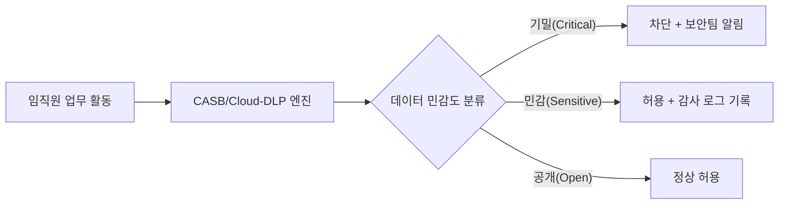
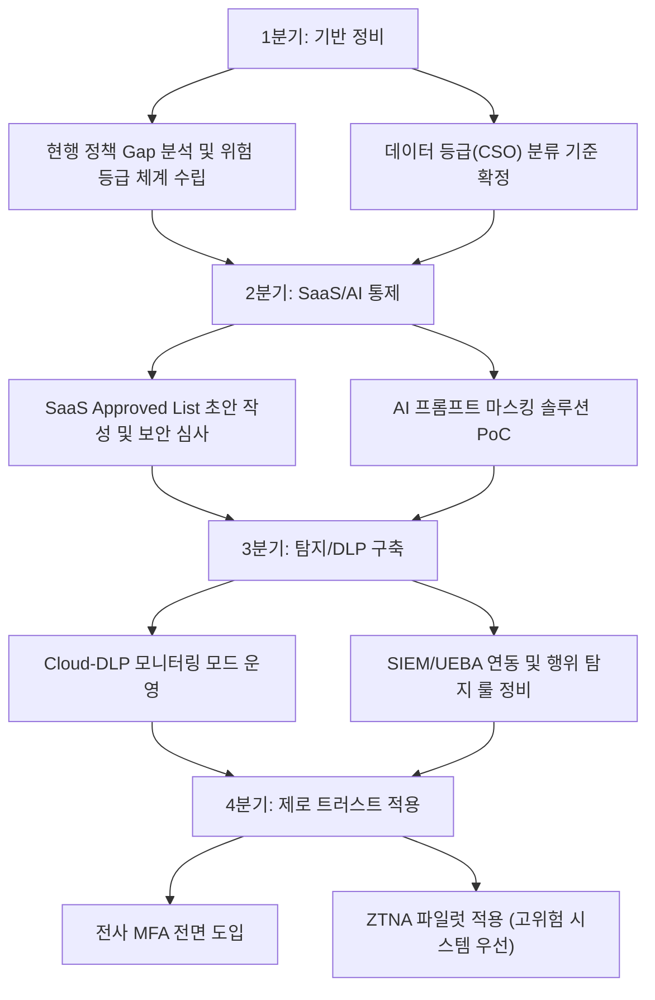

# 보안 정책 현대화: 망 분리·SaaS·DLP·점검 방식의 개정 전후 완전 비교

정보보안 정책 담당자로서 수년 동안 가장 빈번하게 마주치는 고민이 있습니다. 바로 **"우리 회사의 보안 정책이 현실을 따라가고 있는가?"** 라는 질문입니다.

불과 몇 년 전만 해도 "망 분리 = 물리적 인터넷 차단"이라는 등식이 보안의 기본 공리처럼 여겨졌습니다. SaaS는 원칙적으로 금지, USB는 봉인, 점검은 분기마다 체크리스트. 이 방식이 틀렸던 것은 아닙니다. 하지만 클라우드 네이티브 환경, 생성형 AI 업무 도입, 원격·하이브리드 근무의 일상화 앞에서 **기존 정책은 이제 보호막이 아닌 병목(Bottleneck)으로 기능하기 시작**했습니다.

이 글에서는 **4가지 핵심 보안 정책 영역(망 보안 통제 / SaaS·AI 활용 / 데이터 보안 / 점검 방식)**에 대해 개정 전·후를 비교하고, 각 영역의 개정 배경과 실무 적용 포인트를 상세히 정리합니다.

---

## 한눈에 보는 정책 개정 전후 요약표

| 구분 | 기존 정책 (개정 전) | 최신 규제 트렌드 반영 정책 (개정 후) |
| :--- | :--- | :--- |
| **망 보안 통제** | 물리적/논리적 인터넷 차단 중심 | 데이터 등급(CSO)별 차등 통제 + 제로 트러스트 적용 |
| **SaaS/AI 활용** | 원칙적 금지 또는 예외적 허용 | 가이드라인 내 보안 요건 충족 시 허용 (Auto-Approval) |
| **데이터 보안** | 단말기/매체 통제 (USB, 메일) | API 프롬프트 키워드 마스킹 및 Cloud-DLP 연동 |
| **점검 방식** | 정기적인 체크리스트 위주 점검 | 행위 기반 상시 위협 탐지 및 위험 평가(Risk-based) |

> [!IMPORTANT]
> 이 개정은 "보안을 느슨하게 한다"는 의미가 아닙니다. **통제 방식을 전환**하는 것입니다. 막는 위치(Perimeter)를 바꾸고, 점검 빈도(Periodic)를 상시(Continuous)로 전환하는 패러다임 시프트입니다.

---

## 1. 망 보안 통제: 물리적 차단 → 데이터 등급 기반 제로 트러스트

### 기존 정책의 한계

기존의 망 보안은 **"안에 있으면 신뢰, 밖은 모두 위험"** 이라는 경계 보안(Perimeter Security) 모델에 기반했습니다. 물리적으로 인터넷 구간과 내부망을 완전히 분리하고, 분리된 망 사이의 데이터 이동은 보안USB나 단방향 전송 장비를 통해서만 허용하는 방식이었습니다.

이 모델의 문제는 클라우드 SaaS, 재택근무, 외부 협력사와의 데이터 연동이 일상화되면서 **"안에 있는 사람"의 범위 자체가 모호해졌다는 점**입니다. VPN을 통해 접속한 임직원도, 퇴사 직전의 내부자도, 이미 탈취된 계정도 모두 "신뢰된 내부"로 간주됩니다.

### 개정 후 정책: 데이터 등급별 차등 통제 + 제로 트러스트

개정 정책의 핵심은 **"어디에 있는가"가 아닌 "무엇에 접근하는가"** 를 기준으로 통제 수준을 결정하는 것입니다.

```
통제 기준: 데이터 등급(CSO: Critical / Sensitive / Open)
  ├── Critical (기밀): 강화된 MFA + 세션 기반 접근 + 행위 로깅 필수
  ├── Sensitive (민감): 표준 인증 + 역할 기반 접근(RBAC)
  └── Open (공개): 최소 인증 요건 충족 시 허용
```

**제로 트러스트(Zero Trust)의 실무 적용 포인트:**

*   **명시적 검증(Verify Explicitly)**: 사용자 신원, 기기 상태(MDM 등록 여부, 패치 수준), 위치 정보를 복합적으로 판단하여 매 세션마다 신뢰를 재평가합니다.
*   **최소 권한(Least Privilege Access)**: 업무에 필요한 최소한의 리소스에만 접근 권한을 부여하고, 사용하지 않는 계정과 권한은 주기적으로 회수합니다.
*   **침해 가정(Assume Breach)**: 이미 내부망이 침해되었다는 전제 하에, 측면 이동(Lateral Movement)을 최소화하기 위한 마이크로 세그멘테이션을 적용합니다.

> [!TIP]
> 제로 트러스트는 단일 솔루션이 아닙니다. **ZTNA(Zero Trust Network Access), CASB(Cloud Access Security Broker), IAM(Identity & Access Management)** 의 통합 아키텍처로 구현됩니다. 도입 시 전체 아키텍처를 먼저 설계하고 단계적으로 적용하는 로드맵 수립을 권장합니다.

---

## 2. SaaS/AI 활용 정책: 원칙 금지 → 가이드라인 기반 Auto-Approval

### 기존 정책의 한계

"SaaS 사용은 원칙적으로 금지"라는 정책은 표면적으로는 강력해 보이지만, 현실에서는 **섀도우 IT(Shadow IT)의 온상**이 됩니다. 공식적으로 막혀있지만, 구성원들은 개인 이메일로 ChatGPT를 사용하거나 개인 클라우드 스토리지로 업무 파일을 공유합니다. 눈에는 보이지 않지만, 실질적인 데이터 유출 경로는 그대로 존재하는 상황입니다.

특히 생성형 AI 서비스가 업무 생산성에 미치는 영향이 명백해진 현재, **"사용을 금지한다"는 정책의 실행 가능성 자체**가 낮아졌습니다.

### 개정 후 정책: 보안 요건 충족 시 Auto-Approval

개정 정책에서는 SaaS/AI 서비스를 **사전에 정의된 보안 요건 체크리스트**를 충족하는 경우에 한해 자동 승인(Auto-Approval) 또는 패스트트랙 심사를 적용합니다.

**Auto-Approval 요건 체크리스트 예시:**

| 검토 항목 | 세부 기준 |
| :--- | :--- |
| 데이터 처리 위치 | 국내 또는 EU GDPR 준수 국가에 데이터 저장 |
| 전송 구간 암호화 | TLS 1.2 이상 사용 |
| 계정 보안 | SSO/SAML 연동 또는 MFA 지원 |
| 데이터 반출 제어 | API 레벨 데이터 다운로드 제한 기능 제공 |
| 감사 로그 | 관리자 콘솔에서 접근/다운로드 로그 제공 |
| AI 학습 사용 금지 | 입력된 업무 데이터가 AI 모델 학습에 사용되지 않는다는 약관 확인 |

> [!NOTE]
> **Auto-Approval이라는 명칭에도 불구하고**, 이 체크리스트는 보안팀이 최초 1회 해당 서비스에 대해 수행하고 결과를 정책에 등재하는 방식으로 운영됩니다. 임직원은 등재된 서비스 목록(Approved List) 안에서 자율적으로 선택하며, 새로운 서비스는 보안 심사 후 목록에 추가됩니다.

---

## 3. 데이터 보안: 매체 통제 → API 마스킹 + Cloud-DLP

### 기존 정책의 한계

기존 데이터 보안의 주력 수단은 **USB 사용 금지, 메일 용량 제한, 외부 전송 차단** 이었습니다. 이 방식은 물리적 매체나 전통적인 이메일 채널을 통한 유출에는 효과적이지만, 다음과 같은 새로운 데이터 이동 경로에는 무방비 상태입니다.

*   **생성형 AI 프롬프트 입력**: "이 계약서 초안을 요약해줘"라며 기밀 문서를 ChatGPT에 통째로 붙여넣기
*   **Cloud API 연동**: 내부 시스템과 외부 SaaS를 API로 연동하면서 비식별화 없이 개인정보 전송
*   **협업 툴 첨부**: Slack, Teams, Notion 등에 기밀 파일을 무심코 공유

### 개정 후 정책: API 프롬프트 마스킹 + Cloud-DLP

개정 정책은 **"데이터가 이동하는 경로"가 아닌 "데이터 자체"를 보호**하는 방향으로 전환합니다.

**① API 프롬프트 키워드 마스킹**

생성형 AI 서비스 사용 시, 프롬프트 인터셉터(Proxy) 레이어를 통해 특정 패턴의 데이터를 자동으로 마스킹합니다.

```
[마스킹 처리 예시]
입력: "이 계약서에서 홍길동(750101-1234567)의 연봉 조건을 확인해줘"
처리: "이 계약서에서 [PERSON_MASKED]([PII_MASKED])의 연봉 조건을 확인해줘"
```

적용 대상 패턴: 주민등록번호, 계좌번호, 카드번호, 특정 키워드(프로젝트 코드명, 고객사명 등 정의 가능)

**② Cloud-DLP(Data Loss Prevention) 연동**

전통적인 네트워크 DLP가 트래픽을 차단하는 방식이라면, Cloud-DLP는 **클라우드 스토리지, SaaS, API 트래픽에 직접 연동**되어 데이터의 민감도를 실시간으로 분류하고 정책을 적용합니다.



> [!WARNING]
> Cloud-DLP 도입 시 **오탐(False Positive) 관리**가 가장 큰 운영 도전 과제입니다. 초기 6개월은 차단 정책보다 모니터링 모드(Alert Only)로 운영하며, 실제 업무 패턴 기반의 예외 규칙을 수립한 후 차단 정책을 단계적으로 강화할 것을 권장합니다.

---

## 4. 점검 방식: 체크리스트 → 행위 기반 상시 위협 탐지(Risk-based)

### 기존 정책의 한계

분기별 또는 연간 체크리스트 기반 점검은 **"점검일의 스냅샷"만 반영**한다는 치명적인 한계가 있습니다.

예를 들어 1분기 점검에서 적합 판정을 받은 서버가 1분기 점검 이후 새로운 취약점이 공개되거나, 점검 이후 잘못된 설정 변경이 이루어져도 다음 분기 점검 때까지 아무도 인지하지 못합니다. 사고는 체크리스트가 없는 그 사이 기간에 발생합니다.

### 개정 후 정책: 행위 기반 상시 위협 탐지 + 위험 평가(Risk-based)

**행위 기반(Behavior-based) 탐지의 핵심**은 "무엇을 했는가"를 기준으로 이상 징후를 탐지하는 것입니다. 단순히 룰(Rule)에 매칭되는 이벤트를 잡는 것을 넘어, **평상시 행위 패턴의 통계적 이상(Anomaly)**을 감지합니다.

| 탐지 시나리오 | 행위 기반 탐지 예시 |
| :--- | :--- |
| **내부자 위협** | 평소 10MB/일 수준의 데이터를 접근하던 사용자가 특정일 2GB 다운로드 시도 감지 |
| **계정 탈취** | 서울에서 정상 로그인 후 5분 이내에 해외 IP에서 동일 계정 로그인 시도 감지 |
| **권한 남용** | 업무시간 외(심야/주말) 데이터베이스 대량 조회 쿼리 실행 감지 |
| **악성코드 측면 이동** | 일반 사용자 PC에서 내부 서버로 비정형 포트 스캔 시도 감지 |

**위험 평가(Risk-based) 점검의 실무 적용:**

1.  **자산 위험 등급화**: 모든 자산을 취급 정보의 민감도와 서비스 중요도에 따라 등급화하고, 고위험 자산은 점검 빈도와 심도를 차등 적용합니다.
2.  **위험 점수(Risk Score) 자동 갱신**: 취약점 발견, 미패치 기간 경과, 접근 이상 탐지 등의 이벤트 발생 시 자산의 위험 점수를 실시간으로 갱신합니다.
3.  **임계치 초과 시 자동 알림**: 특정 자산의 위험 점수가 사전 설정된 임계치를 초과하면 담당자에게 자동 알림 및 점검 지시를 발송합니다.

> [!NOTE]
> 이 체계를 구현하기 위해서는 **SIEM(보안 정보·이벤트 관리) + UEBA(사용자·엔티티 행위 분석)** 의 연동이 필수입니다. 도입 예산이 제한적인 경우, 오픈소스 기반의 Wazuh + OpenSearch 조합으로 단계적 구축을 시작할 수 있습니다.

---

## 5. 정책 개정 시 현실적으로 마주치는 3가지 난관과 해법

아무리 좋은 방향으로 정책을 개정해도, 조직 내부에서는 반드시 다음과 같은 저항과 우려가 발생합니다. 미리 대비해야 할 논점들입니다.

### ❶ "더 많이 허용하면 감사에서 지적당하는 것 아닌가?"

**대응 논리**: 감사 기관(ISMS-P 심사, 금융감독원 검사 등)은 "무조건 막느냐"가 아니라 **"위험을 식별하고 통제하고 있는가"** 를 봅니다. 오히려 SaaS 사용 현황이 투명하게 관리되고, 접근 로그가 남으며, 이상 징후 시 대응 프로세스가 있다면 더 높은 성숙도(Maturity) 평가를 받을 수 있습니다.

### ❷ "제로 트러스트 구축 예산이 없다"

**대응 논리**: 제로 트러스트는 전사 일괄 전환이 아닌 **단계별 적용이 가능**합니다. 1단계: 강력한 MFA 전면 도입, 2단계: 가장 중요한 내부 시스템에 RBAC/최소 권한 정비, 3단계: ZTNA 솔루션 도입 순으로 2~3년에 걸쳐 로드맵을 수립하면 예산 부담을 분산할 수 있습니다.

### ❸ "임직원들이 정책 변경을 이해하고 따라줄 수 있을까?"

**대응 논리**: 정책이 바뀌면 제일 먼저 해야 할 일은 **"왜 바뀌었는가"에 대한 설명**입니다. 단순히 "새 규정 배포"가 아니라, "예전에는 인터넷을 막았지만 이제는 여러분의 사용 패턴을 보호하는 방식으로 바뀐다"는 커뮤니케이션이 선행되어야 합니다. 짧은 설명 자료와 Q&A 채널 운영을 병행하면 현장의 혼란을 최소화할 수 있습니다.

---

## 6. 정책 현대화 실행 로드맵 (1년 단위)



---

## 7. 마치며: 보안 정책 개정의 목표는 "통제"가 아닌 "신뢰"

보안 정책을 현대화하는 궁극적인 목표는 단순히 최신 기술을 도입하거나 규제를 충족하는 것이 아닙니다. **비즈니스와 보안이 서로의 발목을 잡지 않고 함께 성장할 수 있는 신뢰 기반의 환경**을 만드는 것입니다.

"막는 것"에서 "이해하는 것"으로, "정기 점검"에서 "상시 탐지"로, "예외적 허용"에서 "원칙적 가능하되 추적 가능"으로의 전환이 이루어질 때, 보안팀은 비로소 비즈니스의 파트너로 자리잡을 수 있습니다.

개정 전후의 4가지 핵심 정책 변화가 여러분 조직의 보안 현대화 여정에 실무적인 출발점이 되기를 바랍니다.

---

## 정책 현대화 전 자가 진단 체크리스트

다음 보안 정책 개정 작업에 들어가기 전, 아래 질문에 몇 개나 "예"라고 답할 수 있는지 확인해 보세요.

- [ ] 현재 우리 조직의 데이터는 민감도에 따라 공식적으로 등급화되어 있는가?
- [ ] 임직원이 업무에 사용하는 SaaS/AI 서비스 목록이 보안팀에 파악되어 있는가?
- [ ] 생성형 AI 서비스 사용 시 기밀 정보 입력을 막을 기술적 통제가 존재하는가?
- [ ] 보안 점검 결과가 정기 이벤트(분기 점검)에만 의존하지 않고 상시 갱신되는가?
- [ ] 이상 행위 탐지(UEBA) 결과가 실질적인 대응 액션으로 연결되는 프로세스가 있는가?
- [ ] 제로 트러스트 전환을 위한 단계적 로드맵이 수립되어 있는가?

5개 이상 "예"라면 성숙한 보안 정책 체계를 갖추고 있는 것이고, 3개 미만이라면 오늘이 현대화를 시작할 적기입니다.
