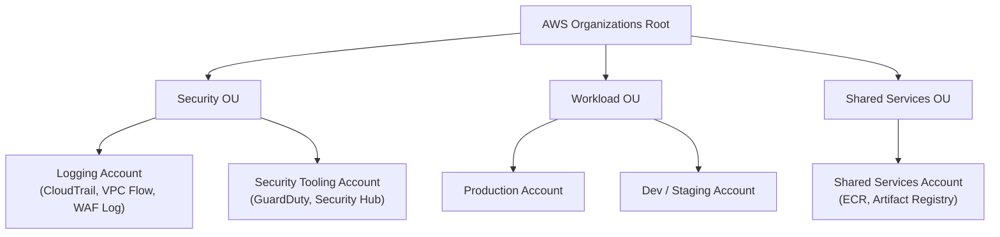
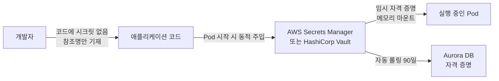
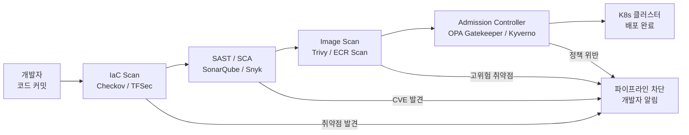
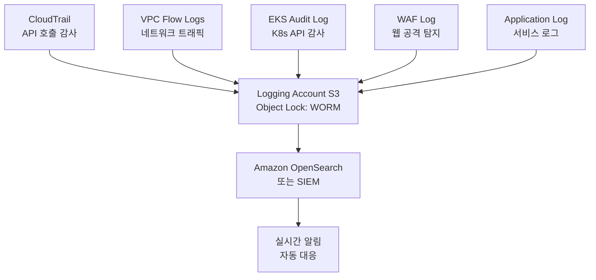
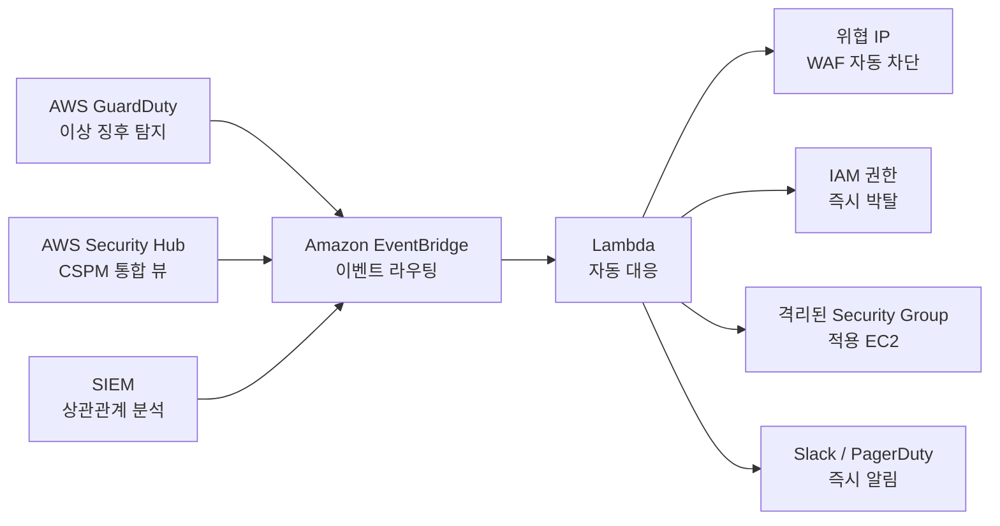
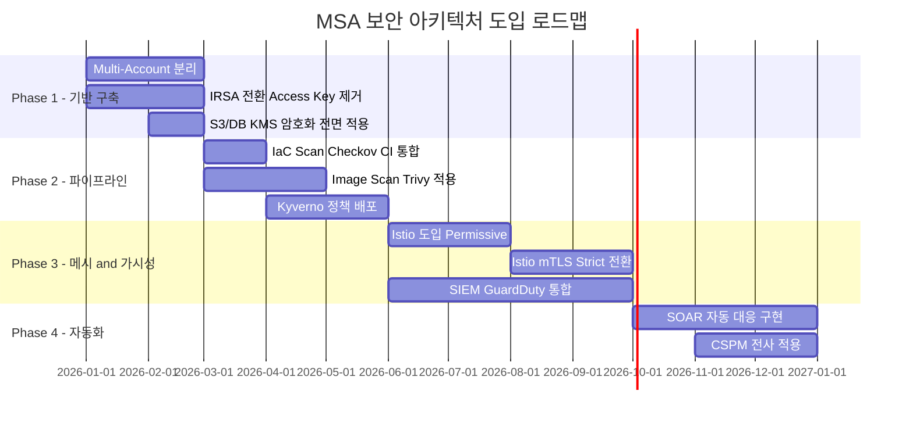

# AWS 기준 클라우드 + K8s/MSA 실무 보안 아키텍처 레퍼런스 모델

클라우드 및 마이크로서비스 아키텍처(MSA) 환경은 기존의 보안 패러다임을 근본적으로 흔듭니다. 경계(Perimeter)는 모호해지고, 서비스 간 통신(East-West Traffic)은 폭증하며, 컨테이너와 인프라는 매 분·매 시간 바뀝니다.

이러한 환경에서 필요한 것은 **"인프라, 애플리케이션, 데이터, 신원(Identity) 전반에 걸쳐 제로 트러스트(Zero Trust)와 DevSecOps를 내재화한 멀티레이어(Multi-layered) 보안 아키텍처"** 입니다.

이 글에서는 실무에서 가장 표준적으로 활용되는 **AWS 기준 클라우드 + K8s/MSA 환경의 보안 아키텍처 레퍼런스 모델**을 영역별로 구조화하여 설명합니다.

---

## 1. 클라우드 & MSA 보안 아키텍처 청사진 (Architecture Blueprint)

전체 아키텍처는 외부 사용자부터 데이터 계층까지 4개의 방어 레이어로 구성됩니다.

```
[ External User / Client ]
           │
           ▼
┌────────────────────────────────────────────────────────────────────────┐
│ 1. Edge & Perimeter Defense (AWS Shield + WAF + CloudFront)           │
└──────────────────────────┬─────────────────────────────────────────────┘
                           │ TLS Termination & DDoS / OWASP Top 10 Filtering
                           ▼
┌────────────────────────────────────────────────────────────────────────┐
│ 2. Ingress & API Gateway Zone (Public VPC)                            │
│    - AWS ALB / API Gateway + OAuth2/OIDC Auth Check                   │
└──────────────────────────┬─────────────────────────────────────────────┘
                           │ mTLS / JWT Forwarding
                           ▼
┌────────────────────────────────────────────────────────────────────────┐
│ 3. Application Mesh / K8s Cluster Zone (Private VPC / Subnet)         │
│                                                                        │
│   ┌─────────────────────┐             ┌─────────────────────┐          │
│   │  Service A (Pod)    │─── mTLS ───▶│  Service B (Pod)    │          │
│   │  Sidecar Proxy      │  (Istio)    │  Sidecar Proxy      │          │
│   └──────────┬──────────┘             └──────────┬──────────┘          │
│              │                                   │                     │
│              │ Network Policy                    │ IRSA (IAM)          │
│              ▼                                   ▼                     │
│   ┌─────────────────────┐             ┌─────────────────────┐          │
│   │ Security Group      │             │ KMS (Customer Key)  │          │
│   └─────────────────────┘             └─────────────────────┘          │
└──────────────────────────┬─────────────────────────────────────────────┘
                           │
                           ▼
┌────────────────────────────────────────────────────────────────────────┐
│ 4. Data & Persistence Zone (Isolated Data Subnet)                      │
│    - Amazon Aurora DB / DynamoDB / S3 (KMS Envelope Encryption)       │
└────────────────────────────────────────────────────────────────────────┘
```

각 레이어는 다음 원칙으로 설계됩니다.

| 레이어 | 방어 목적 | 핵심 기술 |
| :--- | :--- | :--- |
| **1. Edge** | DDoS 차단, OWASP Top 10 필터링 | AWS Shield Advanced, WAF, CloudFront |
| **2. Ingress** | 인증 검증, API 노출 제어 | ALB, API Gateway, OAuth2/OIDC |
| **3. App Mesh** | East-West 트래픽 제로 트러스트 | Istio mTLS, Network Policy, IRSA |
| **4. Data** | 저장 데이터 암호화, 격리 | KMS CMK, Aurora, S3 Object Lock |

> [!IMPORTANT]
> 이 아키텍처의 핵심은 **"IP 기반 경계 통제"에서 "Identity 기반 통제"로의 전환**입니다. 어디에 있는지(Where)가 아니라, 누가(Who) 무엇에(What) 접근하는지를 기준으로 모든 통제가 동작해야 합니다.

---

## 2. 영역별 실무 핵심 설계 통제 (Security Controls)

### ① 계정 및 신원 관리 (Account & IAM Structure)

#### AWS Organizations 기반 Multi-Account 전략

단일 계정에 모든 자원을 집중하는 것은 폭발 반경(Blast Radius)을 키우는 가장 위험한 설계 결정입니다. 실무에서는 AWS Organizations를 활용하여 계정을 용도별로 엄격히 분리합니다.



- **Logging Account**: 모든 감사 로그를 중앙 집중하고, S3 Object Lock으로 원천 삭제·수정을 방지합니다.
- **Security Tooling Account**: GuardDuty, Security Hub, Config를 중앙 관리합니다.
- **Workload Account**: 실제 애플리케이션이 실행되는 계정으로, Production과 Dev를 분리하여 개발 실수가 운영에 미치는 영향을 차단합니다.

#### Service-to-AWS: IRSA (IAM Roles for Service Accounts)

EKS Pod 내 애플리케이션이 AWS 자원(S3, DynamoDB 등)에 접근할 때 **정적 ACCESS KEY를 절대 배포하지 않습니다.**

OIDC 연동을 통해 Pod 단위로 최소 권한의 IAM Role을 동적으로 할당하는 IRSA(IAM Roles for Service Accounts) 패턴을 사용합니다.

```
[동작 원리]
EKS Pod (Service Account 마운트)
  │
  ├─ OIDC Token 자동 발급
  │
  ▼
AWS STS AssumeRoleWithWebIdentity
  │
  ▼
임시 자격 증명 발급 (TTL 1시간) → S3 / DynamoDB 접근
```

> [!TIP]
> IRSA 도입 시 IAM Role에 `Condition` 절을 반드시 추가하여 특정 네임스페이스의 특정 Service Account에서만 해당 Role을 Assume할 수 있도록 제한하세요. 와일드카드(`*`) 조건은 Role 탈취 시 모든 Pod으로 권한이 확대될 위험이 있습니다.
>
> ```json
> "Condition": {
>   "StringEquals": {
>     "oidc.eks.ap-northeast-2.amazonaws.com/id/XXXX:sub":
>       "system:serviceaccount:production:payment-service"
>   }
> }
> ```

#### Human-to-AWS Access: PAM & SSO

사람의 AWS 접근은 장기 자격 증명(Long-term Credentials)을 완전히 제거합니다.

- **AWS IAM Identity Center(SSO) + Okta/Entra ID 연동**: 임시 세션 토큰만 발급
- **Production 환경 JIT(Just-In-Time) 접근**: 일상적인 직접 접근을 차단하고, 승인 워크플로우를 통해 일시적 권한만 부여
- **Break-Glass 계정**: 장애 시 사용하는 비상 계정은 별도 관리하고, 사용 즉시 알림 발송

---

### ② 네트워크 & MSA 서비스 간 통신 (Network & Service Mesh)

#### Ingress/Egress 통제

클라우드 환경에서 네트워크 통제의 핵심은 **인입(Ingress)과 외부 통신(Egress) 경로를 단일 지점으로 수렴**시키는 것입니다.

```
[Ingress 통제]
External → CloudFront → WAF → ALB (Public Subnet)
            └─ TLS 종단   └─ OWASP 필터링

[Egress 통제]
Private Subnet → NAT Gateway → Network Firewall → 인터넷
                               └─ 허용 FQDN 화이트리스트만 통과
```

Private Subnet에서 외부로 나가는 모든 트래픽은 허용된 도메인(FQDN)으로만 통신을 제한합니다. 이를 통해 악성코드 C2(Command & Control) 서버와의 통신 차단 및 데이터 유출 경로를 통제합니다.

#### Service Mesh (Istio) 기반 Zero Trust

K8s 클러스터 내부의 Pod 간 통신(East-West Traffic)은 기본적으로 신뢰하지 않습니다. Istio Service Mesh를 통해 모든 Pod 간 통신에 자동으로 제로 트러스트를 적용합니다.

**핵심 적용 항목:**

| 통제 항목 | 설명 | Istio 구현 |
| :--- | :--- | :--- |
| **mTLS (Mutual TLS)** | Pod 간 통신 전 구간 암호화 및 상호 인증 | `PeerAuthentication` (STRICT 모드) |
| **L7 Authorization Policy** | Service A → Service B의 특정 API(경로/메서드)만 허용 | `AuthorizationPolicy` |
| **Traffic Observability** | 서비스 간 트래픽 메트릭, 분산 추적 | Kiali, Jaeger 연동 |
| **Circuit Breaker** | 특정 서비스 장애 시 전파 차단 | `DestinationRule` |

> [!NOTE]
> Istio의 `PeerAuthentication`을 전체 메시 레벨에서 `STRICT` 모드로 설정하면, 사이드카 Proxy가 없는 레거시 서비스와의 통신이 차단됩니다. 단계적 마이그레이션을 위해 처음에는 `PERMISSIVE` 모드로 시작하여 mTLS가 적용되지 않는 트래픽을 탐지한 후, 네임스페이스 단위로 `STRICT`로 전환하는 로드맵을 권장합니다.

---

### ③ 데이터 및 비밀번호 관리 (Data Security & Secrets Management)

#### 봉투 암호화 (Envelope Encryption)

저장 데이터(Data-at-Rest) 암호화는 AWS KMS의 Customer Managed Key(CMK)를 활용한 봉투 암호화(Envelope Encryption) 구조로 구현합니다.

```
[봉투 암호화 구조]

실제 데이터 (Plaintext)
  │
  └─ Data Encryption Key (DEK) 로 암호화 → 암호화된 데이터 (S3/Aurora 저장)
        │
        └─ CMK (Customer Master Key, KMS 관리) 로 암호화 → 암호화된 DEK (함께 저장)
```

**적용 대상 및 구성:**

| AWS 서비스 | 암호화 방식 | Key 관리 |
| :--- | :--- | :--- |
| S3 | SSE-KMS | CMK (Key Rotation 자동화) |
| Aurora DB | AWS Managed Key 또는 CMK | 연간 자동 교체 |
| EBS (EC2 볼륨) | EBS 암호화 + CMK | 계정 레벨 기본 암호화 활성화 |
| EKS Secrets | KMS 기반 etcd 암호화 | `--encryption-provider-config` |

#### 시크릿 동적 관리 (Secrets Management)

소스코드, Dockerfile, K8s ConfigMap/Secret에 **DB 암호, API Key를 절대 하드코딩하지 않습니다.**



**시크릿 관리 패턴:**

- **AWS Secrets Manager + External Secrets Operator**: Kubernetes가 AWS Secrets Manager에서 시크릿을 동적으로 가져와 `Secret` 오브젝트를 자동 생성·갱신합니다.
- **HashiCorp Vault Agent Sidecar**: Vault Agent가 사이드카로 실행되어 Pod 시작 시 시크릿을 파일로 주입하고, 만료 전 자동으로 갱신합니다.
- **자동 Rotation**: DB 자격 증명은 Secrets Manager의 자동 교체 기능으로 90일 주기 롤링을 적용합니다.

> [!WARNING]
> K8s 기본 `Secret` 오브젝트는 Base64 인코딩일 뿐, 암호화가 아닙니다. EKS 클러스터 생성 시 반드시 `--encryption-provider-config`를 통해 etcd 레벨의 KMS 암호화를 활성화해야 합니다. 또한 Secret에 대한 RBAC을 철저히 적용하여 `get`/`list` 권한을 최소화하세요.

---

### ④ DevSecOps 파이프라인 (Shift-Left Security)

개발 초기부터 배포·운영에 이르는 **자동화된 보안 검증 파이프라인**을 구축하여, 개발자에게 부담을 주지 않으면서도 보안 기준을 강제(Secure by Default)합니다.



#### ① IaC Scan (Checkov / TFSec)

Terraform, CloudFormation 코드를 CI 단계에서 자동 분석하여 오설정을 코드 병합 전에 차단합니다.

```bash
# Checkov 실행 예시 (CI 파이프라인)
checkov -d ./terraform \
  --framework terraform \
  --check CKV_AWS_18,CKV_AWS_19 \
  --soft-fail-on MEDIUM \
  --hard-fail-on HIGH,CRITICAL
```

**주요 탐지 항목:**

- S3 버킷 퍼블릭 액세스 활성화
- Security Group Ingress `0.0.0.0/0` 허용
- 암호화되지 않은 EBS 볼륨
- CloudTrail 비활성화

#### ② SAST / SCA (SonarQube / Snyk)

- **SAST (Static Application Security Testing)**: 소스코드 내 취약점 패턴 탐지 (SQL Injection, XSS, 하드코딩 자격 증명 등)
- **SCA (Software Composition Analysis)**: 오픈소스 라이브러리의 알려진 CVE 탐지 및 라이선스 컴플라이언스 확인

#### ③ Container Image Scan (Trivy / Amazon ECR Scan)

컨테이너 이미지 빌드 시점에 OS 패키지 및 애플리케이션 의존성의 취약점을 탐지합니다.

```bash
# Trivy 이미지 스캔 예시
trivy image \
  --severity HIGH,CRITICAL \
  --exit-code 1 \
  --format sarif \
  --output results.sarif \
  myapp:latest
```

- CVSS Score 7.0 이상(HIGH) 취약점 발견 시 파이프라인 차단
- Amazon ECR에 Push된 이미지는 자동으로 ECR Enhanced Scanning 적용
- **이미지 서명(Cosign)**: 서명되지 않은 이미지는 클러스터 배포를 거부

#### ④ Admission Controller (OPA Gatekeeper / Kyverno)

K8s 클러스터에 배포되는 모든 리소스를 배포 직전에 정책으로 검증합니다.

**필수 적용 정책 예시:**

| 정책 | 내용 | 위반 시 |
| :--- | :--- | :--- |
| **No Root Container** | `runAsNonRoot: true` 강제 | 배포 거부 |
| **No Privileged** | Privileged 컨테이너 금지 | 배포 거부 |
| **Resource Limits Required** | CPU/Memory Limit 미설정 금지 | 배포 거부 |
| **Approved Registry Only** | 허가된 Registry 이미지만 허용 | 배포 거부 |
| **Read-only Root Filesystem** | 루트 파일시스템 읽기 전용 권장 | 경고 |

```yaml
# Kyverno 정책 예시: Root 실행 금지
apiVersion: kyverno.io/v1
kind: ClusterPolicy
metadata:
  name: disallow-root-user
spec:
  validationFailureAction: Enforce
  rules:
    - name: check-runAsNonRoot
      match:
        resources:
          kinds: ["Pod"]
      validate:
        message: "Root 사용자로 컨테이너를 실행할 수 없습니다."
        pattern:
          spec:
            containers:
              - securityContext:
                  runAsNonRoot: true
```

---

### ⑤ 가시성 및 보안 운영 (Visibility & Security Operations)

#### 중앙화 로그 집적 (Centralized Logging)

분산된 MSA 환경에서 보안 가시성의 시작은 **모든 로그를 변조 불가능한 형태로 중앙 집적**하는 것입니다.



**로그 보호 설계:**

- **S3 Object Lock (WORM)**: 로그 파일에 쓰기-한번-읽기-많음(WORM) 정책을 적용하여 침해자가 감사 로그를 삭제·수정하는 것을 원천 차단
- **별도 Logging Account**: Workload 계정이 침해되어도 로그 계정은 독립적으로 보호
- **로그 무결성 검증**: CloudTrail Digest 파일로 로그 위·변조 여부를 자동 검증

#### 실시간 위협 탐지 및 자동 대응 (Detection & Response)



**주요 탐지 솔루션 역할:**

| 솔루션 | 탐지 범위 | 대표 시나리오 |
| :--- | :--- | :--- |
| **AWS GuardDuty** | AI/ML 기반 이상 탐지 | 비정상 위치 API 호출, EC2 봇넷 통신, 크립토마이닝 |
| **AWS Security Hub** | 멀티 계정 보안 상태 통합 | CIS Benchmark 미준수, 오설정 실시간 측정 |
| **Wiz / Prisma Cloud** | CSPM + CWPP | 클라우드 전반 위험 우선순위화(Risk Graph) |
| **SIEM (OpenSearch)** | 로그 상관관계 분석 | 다단계 공격(APT) 시나리오 탐지 |

**자동 대응(SOAR) 시나리오 예시:**

GuardDuty에서 `UnauthorizedAccess:EC2/MaliciousIPCaller` 이벤트 발생 시:

1. EventBridge가 이벤트를 수신하고 Lambda 트리거
2. Lambda가 해당 EC2를 격리 Security Group으로 자동 이동
3. EC2에 연결된 IAM Role의 인라인 정책에 `Deny *` 추가
4. 위협 IP를 WAF IP Set에 자동 등록
5. Slack/PagerDuty로 담당자에게 즉시 알림 발송 (5분 이내 완료)

---

## 3. 단계적 도입 로드맵 (Phase-by-Phase)

조직의 클라우드 성숙도에 따라 다음 순서로 단계적 도입을 권장합니다.



> [!NOTE]
> 로드맵의 각 Phase는 독립적인 비즈니스 가치를 제공해야 합니다. Phase 1의 IRSA 전환만으로도 자격 증명 탈취 위험을 대폭 낮출 수 있으며, 이를 경영진에게 정량적 위험 감소 지표로 보고하면서 다음 Phase의 예산을 확보하는 전략을 권장합니다.

---

## 4. 마치며: 아키텍처는 설계가 아닌 문화다

클라우드 + MSA 보안 아키텍처를 다이어그램으로 그리는 것은 어렵지 않습니다. 진짜 어려운 것은 이 아키텍처가 **매일 배포되는 수십 개의 서비스에서 예외 없이 동작하도록 유지**하는 것입니다.

이를 위해 중요한 것은 기술 스택의 선택이 아니라 다음 세 가지 문화입니다.

1. **Secure by Default**: 보안 설정이 기본값이고, 예외가 명시적 승인을 필요로 해야 합니다.
2. **Everything as Code**: 보안 정책도 코드로 관리하고, 변경 이력을 Git으로 추적해야 합니다.
3. **Continuous Verification**: 한 번 설정하고 잊는 것이 아니라, 상시 검증하고 드리프트를 자동으로 탐지해야 합니다.

이 세 가지 문화가 조직에 뿌리내릴 때, 다이어그램 속의 아키텍처는 비로소 실제 보안으로 기능합니다.
