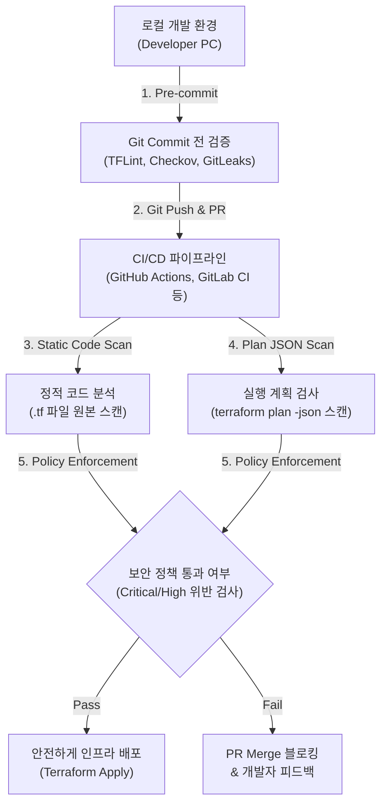

# Terraform IaC 보안 검토 도구 및 도입 단계 가이드

Terraform(IaC) 파일에 대한 보안 검토는 **"배포 전 코드 단계에서 보안 결함과 규정 위반을 미리 차단(Shift-Left Security)"**하기 위해 수행합니다. 

대표적인 검토 도구와 실행 기법, 그리고 단계별 도입 방법을 정리해 드립니다.

---

## 1. 주요 Terraform 보안 검토 도구

### ① Checkov (Palo Alto Networks) - *가장 추천*

* **특징:** 가장 활발히 관리되는 오픈소스 Static Analysis 도구로, 2,500개 이상의 다양한 보안 규칙 및 컴플라이언스(CIS, SOC 2, HIPAA 등) 표준을 기본 제공합니다.
* **장점:** 리소스 간의 연관 관계를 분석하는 **그래프 기반 스캔(Graph-based analysis)** 기능이 강력하여 복잡한(complex) 클라우드 아키텍처 결함을 잘 찾아냅니다. Python/YAML을 이용해 자체 커스텀 정책 작성도 용이합니다.
* **명령어 예시:**
  ```bash
  checkov -d .
  ```

### ② Trivy / tfsec (Aqua Security) - *통합 스캐너*

* **특징:** 과거 가장 널리 쓰이던 `tfsec`이 Aqua Security에 의해 **Trivy**에 통합되었습니다. (신규 프로젝트 도입 시 `tfsec` 대신 `Trivy` 사용 권장)
* **장점:** HCL 파싱 능력이 뛰어나 매우 빠rm며, Terraform 코드뿐만 아니라 Docker 이미지, 컨테이너, OS 취약점, 시크릿(Secret)까지 단일 바이너리로 통합 검사할 수 있습니다.
* **명령어 예시:**
  ```bash
  trivy config .
  ```

### ③ TFLint - *코드 품질 & 오류 검증*

* **특징:** 보안 전문 스캐너라기보다는 **Terraform 전용 Linter**입니다.
* **장점:** 존재하지 않는 인스턴스 유형 참조, 문법 오류, 잘못된 속성값 명시 등 보안 스캐너가 놓치기 쉬운 **구문 및 클라우드 공급자별 사양 오류**를 미리 차단합니다.
* **명령어 예시:**
  ```bash
  tflint --init
  tflint
  ```

### ④ OPA / Rego (Open Policy Agent) - *조직 맞춤형 정책 강제*

* **특징:** 기업 내부의 엄격한 보안 규정이나 정책을 코드화(Policy-as-Code)하여 검증할 때 사용하는 표준 엔진입니다.
* **장점:** `terraform show -json tfplan.json` 결과값을 파싱하여, "태그가 없는 리소스 생성 금지", "특정 크기 이상의 RDS 생성 제한" 등의 조직 특화 규칙을 완벽히 강제할 수 있습니다.

---

## 2. 효과적인 보안 검토 방법론

IaC 보안 검토는 개발 초기부터 배포 단계까지 단계적으로 스크리닝이 이루어져야 효과적입니다.



### Step 1. 로컬 개발 환경 검토 (Pre-commit)

개발자가 코드를 커밋하기 전, 로컬 PC에서 1차 검증을 거쳐 위험 요소가 Git 저장소에 들어가는 것을 막습니다.

* **`pre-commit` 프레임워크 활용:** `.pre-commit-config.yaml`에 `tflint`, `checkov` 등을 등록해 커밋 시 자동 실행되도록 설정합니다.
* **Secret Leak 방지:** Git 커밋 전 `gitleaks`나 `trufflehog`를 함께 사용하여 API Key, Private Key 등 민감 정보가 하드코딩되었는지 차단합니다.

### Step 2. CI/CD 파이프라인 자동화 (PR 및 Build 단계)

GitHub Actions, GitLab CI, Jenkins 등에서 Pull Request(PR) 시 자동 검사를 수행합니다.

1. **정적 코드 분석 (Static Code Analysis):**
   * `.tf` 파일 원본을 대상으로 `Checkov` 또는 `Trivy` 스캔 진행.
   * 보안 위반 레벨(Critical, High) 탐지 시 PR Merge 블로킹 처리.
2. **실행 계획 검사 (Terraform Plan JSON Scan):**
   * 단순 `.tf` 소스 코드뿐만 아니라 `terraform plan`의 결과인 JSON 파일도 함께 스캔합니다. (모듈 참조나 변수 결합으로 발생하는 최종 실행 결과의 위험을 검증)

### Step 3. 보안 정책 수립 및 예외 처리 관리

* **Suppression (예외 처리) 최소화:** 코드 내부 주석(`checkov:skip=...` 등)으로 보안 규칙 검사를 우회하는 행위를 정기적으로 감사해야 합니다.
* **컴플라이언스 맵핑:** CIS Benchmark나 금융보안원 가이드라인 등 조직이 준수해야 할 보안 표준을 검토 도구 옵션에 지정하여 정기 리포트를 생성합니다.

---

## 💡 추천 가이드라인

> [!TIP]
> **신규 도입 시:** **`Checkov`** (다양한 정적 보안 규정 탐지) + **`TFLint`** (코드 오류/규격 검증) 조합을 가장 권장합니다.
>
> **컨테이너/클라우드 전체를 아우르는 단일 툴 원할 시:** `Trivy`를 도입하여 IaC, Dockerfile, 컨테이너 이미지를 한 번에 스캔하는 것이 효율적입니다.
