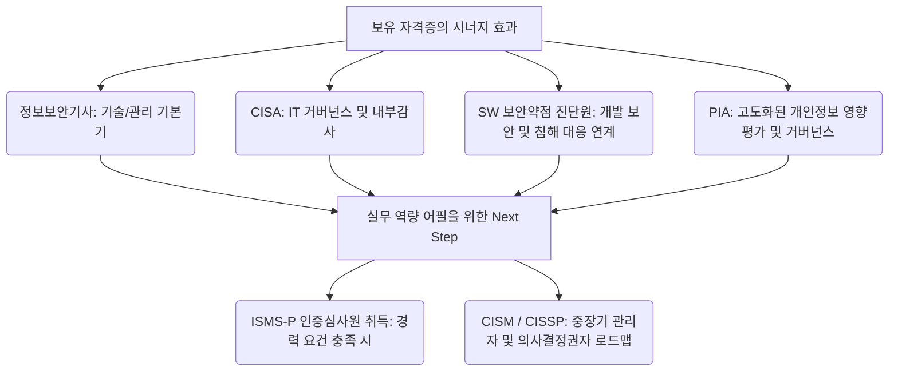

# 정보보호 기획 직무 독학 가이드: 로드맵부터 추천 자격증, 실무 준비법까지

취업 준비생이나 IT/보안 유관 직무에서 전향을 준비하시는 분들이 가장 많이 관심을 가지는 직무 중 하나가 바로 **'정보보호 기획(보안 기획)'**입니다. 

기술적인 모의해킹이나 보안 관제와 달리, 회사 전체의 보안 방향성을 정의하고 법적 규제를 준수하며, 거버넌스 체계를 잡는 '보안의 브레인' 역할을 수행하기 때문입니다. 하지만 "코딩이나 해킹 도구 사용법처럼 명확한 기술 문서가 있는 것도 아닌데, 정보보호 기획은 도대체 어떻게 독학으로 준비해야 하지?"라는 막막함을 느끼기 쉽습니다.

이 글에서는 실제 채용 공고에 등장하는 **정보보호 기획의 4대 주요 업무**를 기준으로, 비전공자나 주니어도 차근차근 독학하여 실무 역량을 갖출 수 있는 구체적인 학습 가이드를 공유합니다.

---

## 📋 정보보호 기획의 4대 주요 업무와 독학 가이드

### 1️⃣ 차세대 정보보호 관리체계 및 미래지향형 정보보호 프레임워크 수립

> **실무의 의미:** ISO27001, ISMS-P 등 국내외 표준 보안 인증 체계를 구축하고 유지관리하며, 회사의 비즈니스 성장에 발맞춰 보안 아키텍처와 Zero Trust, Cloud Security 등 최신 보안 프레임워크를 도입하는 업무입니다.

*   **🎯 독학 가이드 & 학습 방법**
    *   **국내 인증 체계(ISMS-P) 정복하기:** KISA(한국인터넷진흥원) 가이드라인 및 인증 기준 해설서를 탐독하는 것이 기본입니다. [KISA ISMS-P 인증 기준 해설서](https://isms-p.kisa.or.kr)를 다운로드 받아 인증 기준(관리체계 수립/운영, 보호대책 요구사항, 개인정보 처리 단계별 요구사항) 항목들이 실제 기업 환경에서 어떻게 적용되는지 매핑해 봅니다.
    *   **글로벌 프레임워크 이해하기:** ISO/IEC 27001 표준의 통제 항목(Controls) 구조를 학습하고, 클라우드 환경 확산에 따른 글로벌 보안 동향(NIST 사이버보안 프레임워크, Zero Trust 아키텍처)의 개념적 정의를 공부합니다.
    *   **추천 공부법:** 가상의 기업(예: 100명 규모의 이커머스 스타트업)을 하나 설정하고, ISMS-P 인증을 획득하기 위해 필요한 보호대책 항목별 통제 계획을 문서(한 페이지 요약본)로 직접 기획해 보는 연습을 해보세요.

---

### 2️⃣ 중장기 정보보호 전략 기획 및 연간 사업계획 관리

> **실무의 의미:** 회사의 비즈니스 전략과 연계하여 연도별 보안 로드맵을 작성하고, 이에 필요한 예산(CAPEX/OPEX)을 책정하며, 정보보호 사업(예: 보안 솔루션 도입, 컨설팅 수행)의 진척 상황을 관리(PMO)하는 업무입니다.

*   **🎯 독학 가이드 & 학습 방법**
    *   **보안 로드맵/전략 수립 방법론 학습:** IT 거버넌스 프레임워크인 COBIT 또는 CISM(국제공인정보보안관리자)의 '보안 전략 수립' 도메인을 학습하여 전략 기획의 뼈대를 세우는 법을 배웁니다.
    *   **보안 사업계획서 양식 분석 및 작성 연습:** 정보보호 예산을 수립할 때는 단순히 "솔루션이 필요합니다"가 아니라, **비즈니스 리스크를 얼마나 경감시키는지(ROI/ROS - Return on Security Investment)**를 숫자로 설득해야 합니다.
    *   **추천 공부법:** 최신 보안 솔루션(예: EDR, DLP, IAM 등)의 트렌드와 단가를 조사하고, 가상의 예산 1억 원을 활용하여 특정 보안 취약점을 해결하기 위한 **'연간 보안 강화 사업 계획서(RFP 포함)'**를 작성해 보세요. 문서 작성 능력과 기획력이 획기적으로 상승합니다.

---

### 3️⃣ 최신 정보보호 사고 사례, 동향, 교육 및 법령·규제 분석

> **실무의 의미:** 개인정보 보호법, 정보통신망법, 신용정보법(금융권), 전자금융거래법 등 보안과 관련된 법령 규제를 분석하여 회사 정책에 반영하고, 임직원의 보안 의식 강화를 위한 교육 콘텐츠를 기획하며, 매일 발생하는 최신 해킹 사고 분석을 통해 선제적인 예방 조치를 취하는 업무입니다.

*   **🎯 독학 가이드 & 학습 방법**
    *   **핵심 3대 법령 공부:** 개인정보 보호법, 정보통신망법, 정보보호산업법의 주요 조항과 최근 개정 동향을 정독해야 합니다. 국가법령정보센터를 통해 법 조문과 시행령을 확인하세요.
    *   **컴플라이언스 준수성 평가 실습:** 법령 조항별로 기업이 반드시 지켜야 하는 사항(예: 개인정보의 암호화, 접속기록 보관 기간 등)을 정리한 '컴플라이언스 체크리스트(엑셀)'를 만들어 봅니다.
    *   **동향 파악 및 교육 기획:** [KISA 보호나라](https://www.boho.or.kr)나 국내외 보안 뉴스레터(데일리시큐, 보안뉴스 등)를 매일 구독하며 최근 발생하는 랜섬웨어, 공급망 공격 사례를 분석하고, 이를 바탕으로 임직원에게 발송할 '피싱 이메일 예방 가이드 카드뉴스/뉴스레터 기획안'을 만들어 봅니다.

---

### 4️⃣ 정보보호 내부통제 체계 관리, 정보보호 공시 및 투자 계획 수립

> **실무의 의미:** 임직원의 업무 프로세스 전반에 걸쳐 보안 위반 사항이 없는지 감사/점검(내부통제)하고, 상장사 등 의무 대상 기업의 정보보호 투자 및 인력 현황을 대외에 공개하는 '정보보호 공시 제도'를 대응하는 업무입니다.

*   **🎯 독학 가이드 & 학습 방법**
    *   **내부통제와 3선 방어선(Three Lines of Defense) 모델 이해:** 보안 현업 부서(1선), 보안 기획/컴플라이언스 부서(2선), 감사 부서(3선)의 역할 분담 체계를 학습합니다.
    *   **정보보호 공시 제도 학습:** KISA의 [정보보호 공시 종합포털](https://ISDS.kisa.or.kr)에 접속하여 실제 대기업, IT 기업들이 공시한 정보보호 투자 현황, 인력 구성, 인증 획득 현황 보고서들을 다운로드해 분석합니다. 업종별 평균 투자 규모가 어느 정도인지 감을 잡을 수 있습니다.
    *   **추천 공부법:** 관심 있는 기업의 정보보호 공시 데이터를 확인하고, 해당 기업의 취약점이나 개선점을 도출해 보는 '투자 적정성 분석 보고서'를 A4 1~2장 분량으로 요약해 봅니다.

---

## 🎓 보유 자격증을 무기로 삼는 정보보호 기획 실무 준비 로드맵

저는 현재 **정보보안기사, CISA, SW 보안약점 진단원, PIA(개인정보영향평가사)** 자격증을 보유하고 있습니다. 이 자격증 조합은 정보보호 기획 직무에서 **"기술과 컴플라이언스(규제), 그리고 감사(Audit)까지 모두 커버할 수 있는 최상급 스펙"**을 의미합니다. 

이 자격증들을 단순한 스펙 나열에 그치지 않고, 정보보호 기획 실무 역량과 어떻게 연결하여 포트폴리오로 녹여낼 수 있을지 로드맵으로 정리해 드립니다.

### 🛠️ 보유 자격증별 정보보호 기획 실무 매핑 가이드

1.  **정보보안기사 ➔ 기술적 보호조치 및 내부통제 체계 수립**
    *   **실무 매핑:** 회사의 시스템, 네트워크, DB 등 인프라 전반의 보호대책을 수립할 때 "보안기사에서 다루는 기술 통제 기준"을 아키텍처 수준에서 제안할 수 있는 역량을 증명합니다.
2.  **CISA (국제공인정보시스템감사사) ➔ IT 거버넌스 및 연간 보안 감사 기획**
    *   **실무 매핑:** 정보보호 기획 직무의 핵심인 **'내부 통제'**와 **'위험 관리'** 체계를 수립할 때 가장 큰 무기가 됩니다. 내부 정보보호 감사를 직접 기획하고, CISO에게 보고할 거버넌스 프로세스를 구축하는 데 활용합니다.
3.  **SW 보안약점 진단원 ➔ 개발보안(DevSecOps) 및 차세대 프레임워크 설계**
    *   **실무 매핑:** 기술과 기획의 교집합입니다. 차세대 정보보호 프레임워크를 수립할 때, 기획 단계에서부터 **SW 개발보안(시큐어 코딩) 프로세스를 전사 표준 규정(Policy)으로 내재화**하는 정책 기획 역량으로 어필할 수 있습니다.
4.  **PIA (개인정보영향평가사) ➔ 정보보호 공시 및 고도화된 리스크 평가**
    *   **실무 매핑:** 신규 서비스 출시나 IT 시스템 대규모 도입 시, 사전에 프라이버시 침해 요인을 분석하는 **'개인정보 영향평가'**를 내재화하여 컨설팅 비용을 절감하고 리스크를 선제 대응하는 전략 기획가로서의 면모를 보여줄 수 있습니다.

---

## 💡 블로그 독자들을 위한 3가지 실무 포트폴리오 준비 팁

자격증 공부를 넘어 면접관에게 확실한 인상을 남길 수 있는 포트폴리오 설계 팁입니다.

1.  **규제 분석 및 대응 보고서 작성:** 
    *   *예시:* "개인정보 보호법 개정안이 OOO 서비스 비즈니스에 미치는 영향 및 PIA(영향평가) 기반의 보안 대응 전략"과 같은 보고서를 직접 기획안 형태로 작성하여 첨부하세요.
2.  **개발보안 가이드라인 및 규정 설계:** 
    *   *예시:* SW 보안약점 진단원 지식을 바탕으로 "개발 주기(SDLC)별 보안성 검토 프로세스 지침" 혹은 "스타트업을 위한 안전한 API 설계 보안 가이드라인" 등의 정책 문서를 직접 작성해 봅니다.
3.  **내부감사(Audit) 시나리오 설계:** 
    *   *예시:* CISA 관점을 활용하여 "클라우드(AWS/Azure) 환경에서의 연간 정보보호 내부감사 계획서 및 체크리스트"를 도출해 보는 실무 관점의 글을 기록해 두세요.

> [!TIP]
> 정보보호 기획은 **"보안 기술을 비즈니스의 언어로 번역하는 역할"**입니다. 이미 훌륭한 자격증 기반을 가지고 계시기 때문에, 이를 활용해 **비즈니스 리스크를 어떻게 제어하고 생산적인 보안 규정을 만들 것인지**에 대한 기획 역량을 보여주는 것이 핵심입니다.

